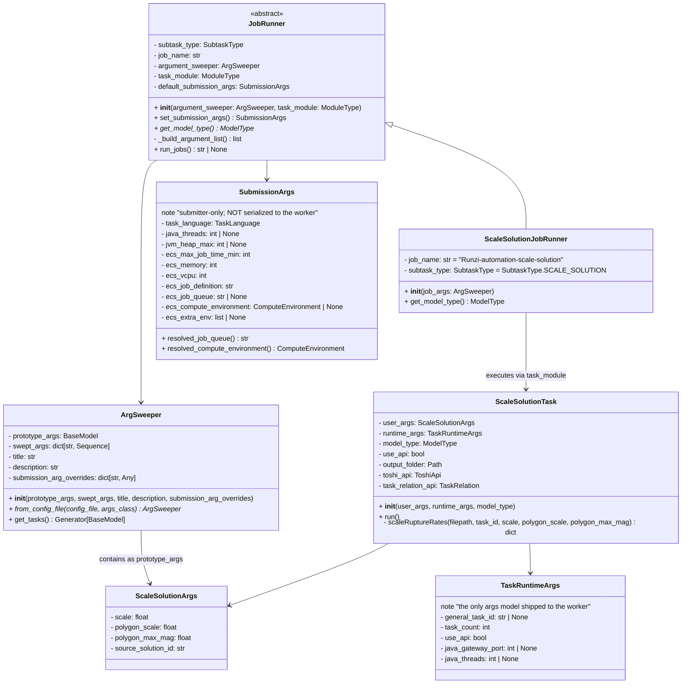

```mermaid
classDiagram
    
    class JobRunner {
        <<abstract>>
        - subtask_type: SubtaskType
        - job_name: str
        - argument_sweeper: ArgSweeper
        - task_module: ModuleType
        - default_submission_args: SubmissionArgs
        
        + __init__(argument_sweeper: ArgSweeper, task_module: ModuleType)
        + set_submission_args() SubmissionArgs
        + get_model_type()* ModelType
        - _build_argument_list() list
        + run_jobs() str | None
    }
    
    class ScaleSolutionJobRunner {
        - job_name: str = "Runzi-automation-scale-solution"
        - subtask_type: SubtaskType = SubtaskType.SCALE_SOLUTION
        
        + __init__(job_args: ArgSweeper)
        + get_model_type() ModelType
    }
    
    class ArgSweeper {
        - prototype_args: BaseModel
        - swept_args: dict[str, Sequence]
        - title: str
        - description: str
        - submission_arg_overrides: dict[str, Any]
        
        + __init__(prototype_args, swept_args, title, description, submission_arg_overrides)
        + from_config_file(config_file, args_class)* ArgSweeper
        + get_tasks() Generator[BaseModel]
    }
    
    class SubmissionArgs {
        note "submitter-only; NOT serialized to the worker"
        - task_language: TaskLanguage
        - java_threads: int | None
        - jvm_heap_max: int | None
        - ecs_max_job_time_min: int
        - ecs_memory: int
        - ecs_vcpu: int
        - ecs_job_definition: str
        - ecs_job_queue: str | None
        - ecs_compute_environment: ComputeEnvironment | None
        - ecs_extra_env: list | None
        + resolved_job_queue() str
        + resolved_compute_environment() ComputeEnvironment
    }
    
    class TaskRuntimeArgs {
        note "the only args model shipped to the worker"
        - general_task_id: str | None
        - task_count: int
        - use_api: bool
        - java_gateway_port: int | None
        - java_threads: int | None
    }
    
    class ScaleSolutionArgs {
        - scale: float
        - polygon_scale: float
        - polygon_max_mag: float
        - source_solution_id: str
    }
    
    class ScaleSolutionTask {
        - user_args: ScaleSolutionArgs
        - runtime_args: TaskRuntimeArgs
        - model_type: ModelType
        - use_api: bool
        - output_folder: Path
        - toshi_api: ToshiApi
        - task_relation_api: TaskRelation
        
        + __init__(user_args, runtime_args, model_type)
        + run()
        - scaleRuptureRates(filepath, task_id, scale, polygon_scale, polygon_max_mag) dict
    }
    
    JobRunner <|-- ScaleSolutionJobRunner
    JobRunner --> ArgSweeper
    JobRunner --> SubmissionArgs
    ArgSweeper --> ScaleSolutionArgs : contains as prototype_args
    ScaleSolutionTask --> ScaleSolutionArgs
    ScaleSolutionTask --> TaskRuntimeArgs
    ScaleSolutionJobRunner --> ScaleSolutionTask : executes via task_module
```
